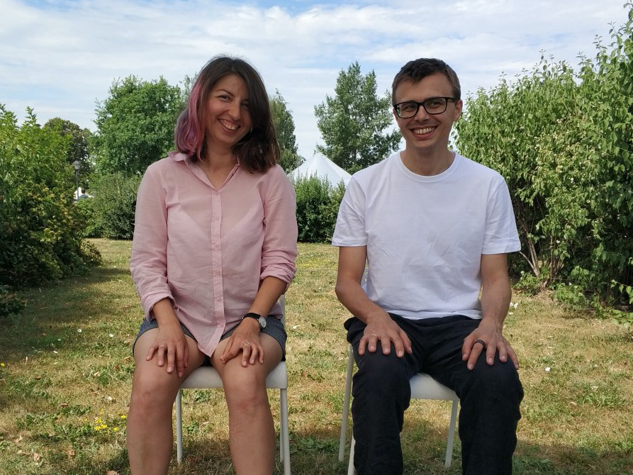

## С какими запросами мы работаем на курсе?

* Хочу научиться концентрироваться 
* Хочу меньше стресса
* Хочу быть меньшим перфекционистом
* Хочу лучше чувствовать связь с телом
* Хочу понимать свое состояния и эмоции

## Для кого этот курс?

Для начинающих в медитации и продолжающих.

## Сколько длится курс?

21 день (с 13 мая по 3 июня 2020)

## Что потребуется?

* 15 минут в день для групповых медитаций (можно и больше).
* 1 час в неделю для онлайн-сессии в Zoom.
* Вести дневник практики, чтобы отслеживать прогресс.
* Присутствовать в чате группы — активность на ваше усмотрение.
* Специального места не требуется, медитировать можно на стуле, а также подушке или скамейке для медитации

## Что вы можете получить по итогам курса?

* Узнаете, какой тип медитации вам больше всего подходит в тот или иной период жизни.
* Научитесь больше присутствовать в моменте
* Научитесь замечать и ценить приятные моменты в вашей жизни
* Поработаете, с тем, что для вас имеет значение
* Лучше узнаете себя, свои желания, эмоции и состояние

## Какая стоимость курса?

Оплата до 8 мая (включительно) 2020 — 4000 рублей за курс.

Оплата с 9 мая 2020 — 5000 рублей за курс.

Перевод на Тинькофф или Сбербанк +7 965 161 37 84.

Если вы проводите курс с партнером или другом, дайте нам знать, мы сделаем скидку.

Кстати, курс можно подарить близкому, другу, коллеге 

## Почему медитация в мини-группе?

* Присутствие других практикующих помогает нам быть более осознанными и прогрессировать быстрее
* В группе каждый понимает, что не одинок в своих препятствиях и отвлечениях в практике. Мы учимся не только на своём опыте, но на опыте других практикующих
* Ежедневная медитация в группе задаёт структуру и ритм, помогает не сдаваться и продолжать. 

## Кто ведёт курс

Мария Ерунова и Глеб Калинин.

* Сертифицированные преподаватели практик осознанности (медитации), ведущие корпоративных программ.
* Ex-топ-менеджеры OZON и OZON.travel
* 14 лет личной практики на двоих
* Популяризаторы практики осознанности 
* Организаторы 24 часового онлайн-марафона медитации «Мы.Здесь.Сейчас»

<!-- <ul class="listing">

  <li>
    <a href="{{ page.url }}">{{ page.data.title }}</a> -
    <time datetime="{{ page.date }}">{{ page.date | dateDisplay("LLLL d, y") }}</time>
  </li>

</ul> -->

<!-- ## Links from an external data source

These links were sourced from [hawksworx.com](https://www.hawksworx.com/feed.json) at build time.

<ul class="listing">

  <li>
    <a href="{{ item.link }}">{{ item.title }}</a>
  </li>

</ul>
 -->

<iframe width="560" height="315" src="https://www.youtube.com/embed/Pzmqz4dP0jc" frameborder="0" allow="accelerometer; autoplay; encrypted-media; gyroscope; picture-in-picture" allowfullscreen></iframe>

